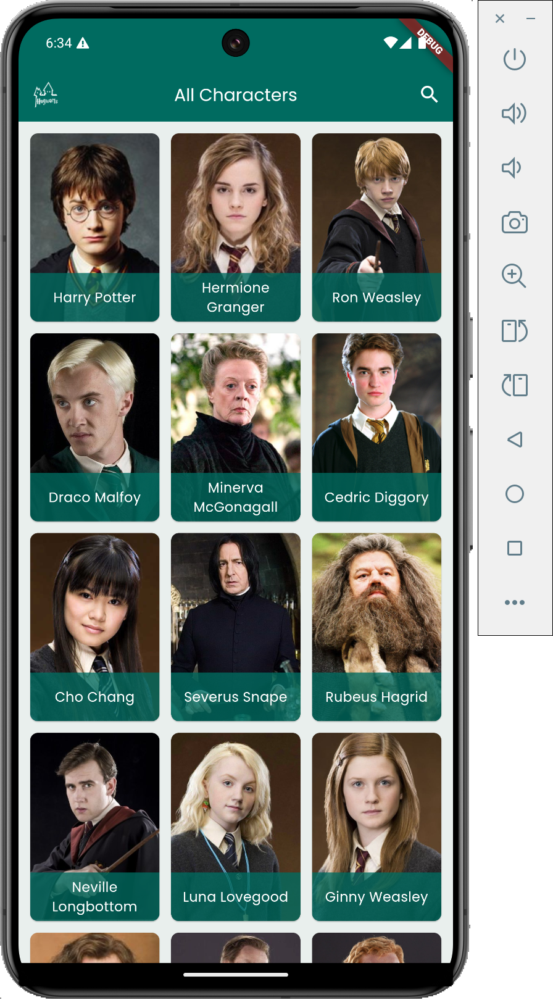
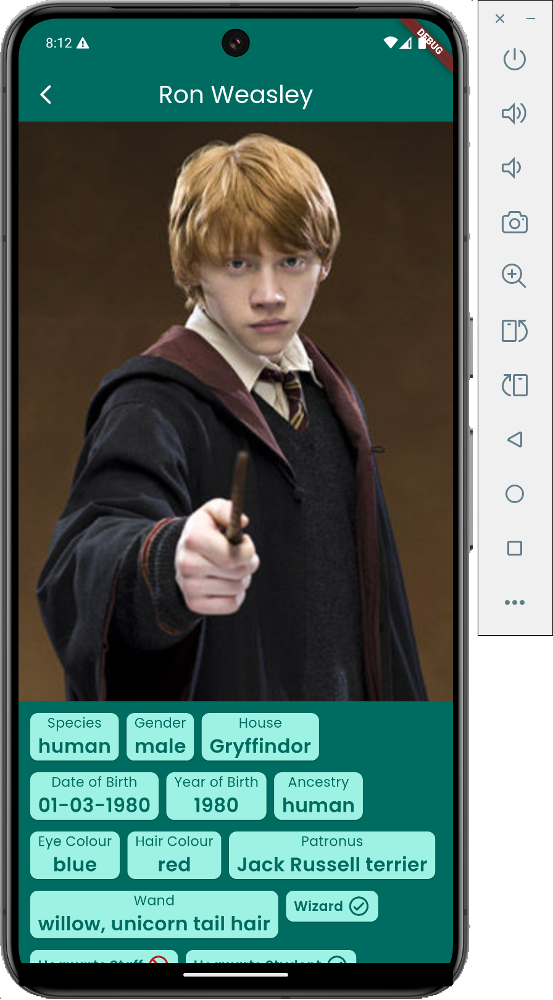
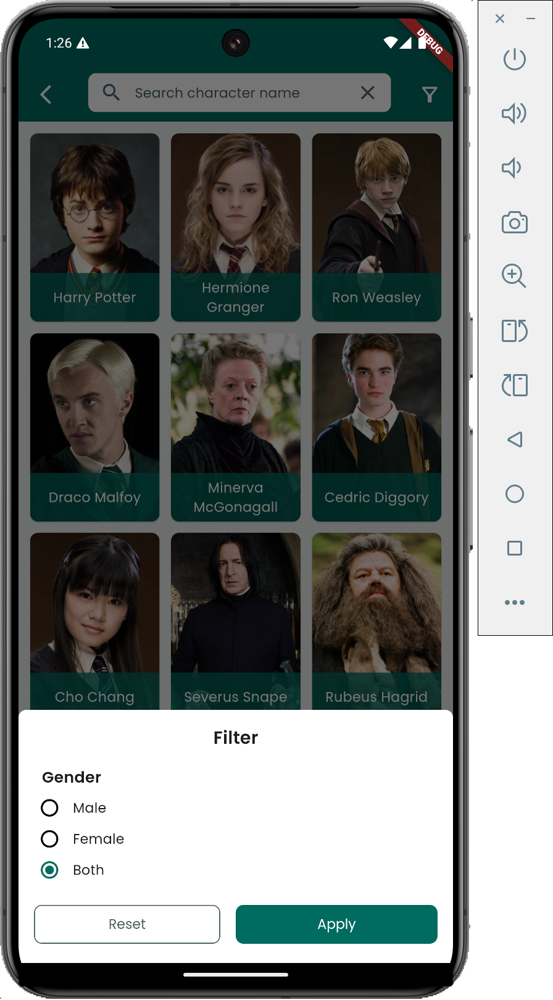

# Hogwarts Flutter App

A beautifully designed, cross-platform mobile and web application that brings the magical world of Hogwarts to life. Built with Flutter, this app showcases characters from the Harry Potter universe with detailed information fetched from a public Harry Potter API.

## ✨ Features

### Core Application Features
- **Character Browser**: Explore a comprehensive collection of Harry Potter characters
- **Detailed Profiles**: View in-depth information including house affiliation, wand details, magical traits, and personal background
- **Advanced Search & Filter**: Find specific characters by name and filter by gender
- **Cross-Platform**: Native mobile experience on iOS and Android with responsive web support
- **Image Caching**: Efficient loading and caching of character images for optimal performance

### Technical Features
- **Modern Architecture**: Clean separation of concerns with controllers, repositories, and services
- **State Management**: Efficient state handling using GetX for reactive programming
- **Network Optimization**: Intelligent caching with Dio and dio_cache_interceptor
- **Immutable Data Models**: Type-safe data handling with Freezed package
- **Professional UI/UX**: Consistent design system with custom themes and typography

## 🛠️ Tech Stack

- **Framework**: Flutter 3.24.3+
- **State Management**: GetX
- **HTTP Client**: Dio with caching interceptor
- **Serialization**: json_serializable with Freezed
- **Image Loading**: Cached Network Image
- **Navigation**: GetX Navigation
- **Platform Support**: iOS, Android, Web
- **Web Deployment**: Firebase Hosting

## 📦 Installation & Setup

### Prerequisites
- Flutter SDK (3.24.3 or later)
- Dart SDK (3.9.0 or later)
- Android Studio or VS Code with Flutter extension

### Steps
1. **Clone the repository**
   ```bash
   git clone git@github.com:obiwancenobi/hogwarts.git
   cd hogwarts
   ```

2. **Install dependencies**
   ```bash
   flutter pub get
   ```

3. **Run the application**
   ```bash
   # For mobile
   flutter run
   
   # For web
   flutter run -d chrome
   ```

4. **Build for production**
   ```bash
   # Android
   flutter build apk
   
   # iOS
   flutter build ios
   
   # Web
   flutter build web
   ```

### Web Deployment to Firebase
1. Build the web version: `flutter build web`
2. Install Firebase CLI: `npm install -g firebase-tools`
3. Login to Firebase: `firebase login`
4. Initialize hosting: `firebase init hosting`
5. Deploy: `firebase deploy`

## 🚀 Usage

### Browsing Characters
- Launch the app to view all characters in a responsive grid layout
- Scroll through the collection or use the search functionality
- Tap any character card to view detailed information

### Searching and Filtering
- Use the search icon in the app bar to access the search screen
- Type character names for real-time filtering
- Use the filter button to narrow results by gender (Male, Female, Both)

### Viewing Character Details
Each character detail screen includes:
- High-quality character image
- Basic information (name, house, species)
- Wand details (wood, core, length)
- Magical attributes (patronus, wizard status)
- Personal information (birth date, ancestry)
- Hogwarts affiliation (student/staff status)

## 🏗️ Project Structure

```
lib/
├── config/                 # App configuration & constants
│   ├── app_colors.dart    # Color palette
│   ├── app_constants.dart # API URLs & constants
│   ├── app_strings.dart   # Localized strings
│   ├── app_text_theme.dart # Typography system
│   └── app_theme.dart     # Main theme configuration
├── data/                  # Data layer
│   ├── api/              # API services & endpoints
│   ├── models/           # Data models (Character, Wand)
│   └── repositories/     # Data repositories
├── screen/               # Application screens
│   ├── detail/          # Character detail screen
│   ├── list/            # Character list screen
│   └── search/          # Search functionality
├── shared/              # Shared components
│   └── view/            # Reusable UI widgets
└── main.dart            # Application entry point
```

## Screenshots
### Web Version


### Mobile Version




## 🤝 Contributing

We welcome contributions to the Hogwarts Flutter App! Please follow these steps:

1. Fork the repository
2. Create a feature branch: `git checkout -b feature/amazing-feature`
3. Commit your changes: `git commit -m 'Add amazing feature'`
4. Push to the branch: `git push origin feature/amazing-feature`
5. Open a pull request

### Development Guidelines
- Follow Dart style guidelines using `dart format`
- Write tests for new features
- Update documentation accordingly
- Ensure cross-platform compatibility

## 📄 License
This project is licensed under the MIT License - see the [LICENSE](LICENSE) file for details.

## 🔮 Future Enhancements

Planned features for future releases:
- Favorite characters functionality
- House-specific filtering and themes
- Spell and potion databases
- Sorting and advanced filtering options
- Dark mode support
- Internationalization (i18n)
- Offline capability with local database

---

**Magical Note**: This app utilizes the [Harry Potter API](https://hp-api.onrender.com/) to fetch character data. All character information and imagery rights belong to their respective owners.